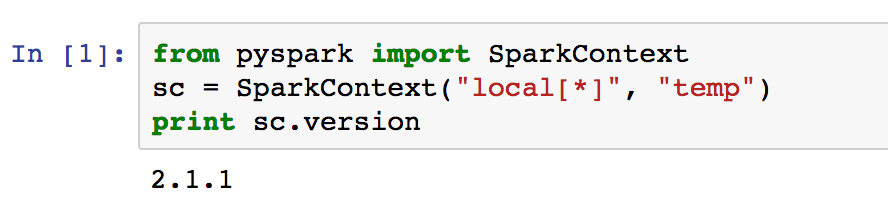
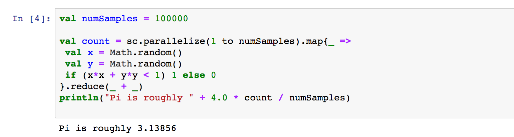

In this post, I will outline the steps to set up Spark on a Mac and have it run on Jupyter notebook with both Scala and Python.

I am using a Mac OS X El Capitan (version 10.11.6), on which I already have Python 2.7 installed with [Anaconda](https://www.continuum.io/downloads). 

### Step I: Homebrew

By now you probably have seen [Homebrew](https://brew.sh/) in a lot of places and are wondering whether you should succumb to it. The answer is yes. Just get it, it will make your life so much easier. 

```
/usr/bin/ruby -e "$(curl -fsSL https://raw.githubusercontent.com/Homebrew/install/master/install)"
```

### Step II: Java

You may already have java installed. Use this command to check:

```
java -version
```

Use this command to install it conveniently:

```
brew cask install java
```

### Step III: Scala

```
brew install scala
```

### Step IV: Apache Spark
```
brew install apache-spark
```

After this is done, verify that spark is installed properly:

```
spark-shell
```
This will bring you to the spark shell:

```
Using Spark's default log4j profile: org/apache/spark/log4j-defaults.properties
Setting default log level to "WARN".
To adjust logging level use sc.setLogLevel(newLevel). For SparkR, use setLogLevel(newLevel).
17/06/30 18:35:58 WARN NativeCodeLoader: Unable to load native-hadoop library for your platform... using builtin-java classes where applicable
17/06/30 18:36:03 WARN ObjectStore: Failed to get database global_temp, returning NoSuchObjectException
Spark context Web UI available at http://10.0.0.50:4040
Spark context available as 'sc' (master = local[*], app id = local-1498862159084).
Spark session available as 'spark'.
Welcome to
      ____              __
     / __/__  ___ _____/ /__
    _\ \/ _ \/ _ `/ __/  '_/
   /___/ .__/\_,_/_/ /_/\_\   version 2.1.1
      /_/
         
Using Scala version 2.11.8 (Java HotSpot(TM) 64-Bit Server VM, Java 1.8.0_131)
Type in expressions to have them evaluated.
Type :help for more information.
```

Try some fancy Scala code:

```
scala> println("Using Spark version " + sc.version)
Using Spark version 2.1.1
```

```
scala> :paste
// Entering paste mode (ctrl-D to finish)

val numSamples = 100000

val count = sc.parallelize(1 to numSamples).map{_ =>
 val x = Math.random()
 val y = Math.random()
 if (x*x + y*y < 1) 1 else 0
}.reduce(_ + _)
println("Pi is roughly " + 4.0 * count / numSamples)

// Exiting paste mode, now interpreting.

Pi is roughly 3.14788                                                           
numSamples: Int = 100000
count: Int = 78697

```
Ok. Enough of Spark shell. Now onto Jupyter notebook. 

### Step V: Apache Toree


Spark shell is all very good. But it does not give you the flexibility of trying out your code in Jupyter notebook. In order to run Spark (Scala or PySpark) code in Jupyter, we will need to install [Apache Toree](https://github.com/apache/incubator-toree). 

Run this to find out where spark is installed: ```brew info apache-spark```

And add these lines in your ~/.bash_profile:

```
export SPARK_HOME=/usr/local/Cellar/apache-spark/2.1.1/libexec
export PYTHONPATH=$PYTHONPATH:$SPARK_HOME/python:$SPARK_HOME/python/lib
```
Run this to install Apache Toree:
```
pip install https://dist.apache.org/repos/dist/dev/incubator/toree/0.2.0/snapshots/dev1/toree-pip/toree-0.2.0.dev1.tar.gz
```
```
jupyter toree install --replace --spark_home=$SPARK_HOME --kernel_name="Spark" --spark_opts="--master=local[*]" --interpreters=Scala
```

One last thing... install py4j. Package is missing in conda, so I went ahead and installed it with pip. 

```
pip install py4j
```

### Step VI: Test it out!

In Jupyter Notebook, try out below. 

#### PySpark:

In Jupyter notebook home, start a 'Python 2' notebook. 



#### Scala:

In Jupyter notebook home, start a 'Spark - Scala' notebook.



And that's it! You now are able to run both Scala and PySpark in Jupyter notebook. 